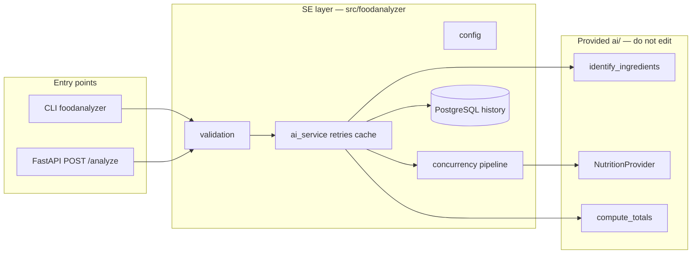

# Architecture (draft)

_Update this diagram as the SE layer grows._

## Status

| Component | Owner | Status |
|-----------|-------|--------|
| `config.py` | — | not started |
| CLI `analyze` | — | not started |
| HTTP `POST /analyze` | — | not started |
| PostgreSQL repository | — | not started |
| Nutrition cache + TTL | — | not started |
| Parallel nutrition lookups | — | not started |
| Retries / backoff | — | not started |
| Dockerfile | — | not started |
