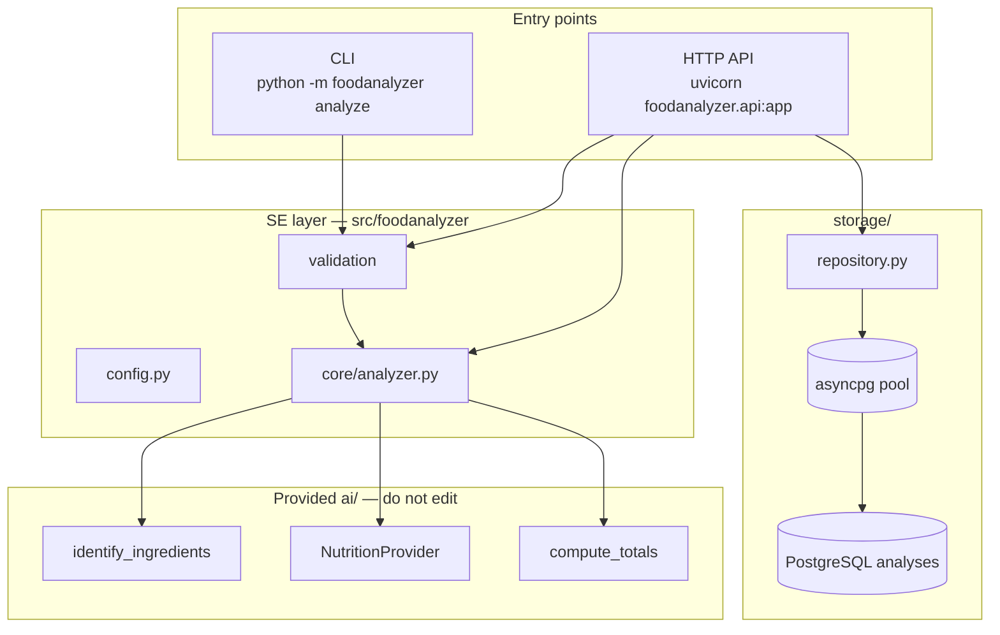

# Architecture

High-level view of the **SE layer** (`src/foodanalyzer/`) around the provided `ai/` module.

## Request flow

### Analyze path (CLI or HTTP)

1. **Validate** image — path (`validate_image_path`) or upload bytes (`validate_image_bytes`). JPEG/PNG only; size capped by `MAX_IMAGE_SIZE_MB`.
2. **Identify** ingredients via VLM (`ai.identify_ingredients`).
3. **Lookup** nutrition per ingredient (`NutritionProvider.lookup`) — currently sequential in `analyzer.py`.
4. **Compute** meal totals (`ai.compute_totals`) and build `AnalysisResult`.
5. **Persist** (HTTP only) — `storage.repository.save()` writes an `AnalysisRecord` to PostgreSQL.

Both CLI and API call the same function: `foodanalyzer.core.analyzer.analyze()`.

## Module map

| Path | Role |
|------|------|
| `config.py` | Typed settings from env (`pydantic-settings`) |
| `models.py` | `AnalysisResult`, `AnalysisRecord`, `IngredientOut`, `TotalsOut` |
| `validation.py` | Image format/size checks; `ValidationError` |
| `core/analyzer.py` | Business pipeline (validate → VLM → nutrition → totals) |
| `api.py` | FastAPI app: `/health`, `/analyze`, `/history` |
| `cli.py` | Argparse CLI with `--offline` and table output |
| `storage/db.py` | Connection pool lifecycle + schema init |
| `storage/repository.py` | `save()`, `list_recent()` |
| `services/ai_service.py` | Retries + timeout wrapper (for future wiring) |
| `services/nutrition_cache.py` | TTL cache wrapper around nutrition lookups |
| `services/retry.py` | Tenacity retry on `ProviderError` |
| `logging_config.py` | Env-driven log level |

## Component status

| Component | Status | Notes |
|-----------|--------|-------|
| `config.py` | done | `Settings`, `DATABASE_URL` from `POSTGRES_*` |
| CLI `analyze` | done | `--offline`, `--json`; uses `core.analyzer` |
| HTTP API | done | See [api.md](./api.md) |
| PostgreSQL repository | done | See [storage.md](./storage.md) |
| Nutrition cache + TTL | partial | `nutrition_cache.py` exists; not wired into `analyzer.py` yet |
| Parallel nutrition lookups | not started | `concurrency/pipeline.py` planned |
| Retries / backoff | partial | `ai_service` + `retry.py`; analyzer still calls `ai.*` directly |
| Dockerfile API CMD | not started | Image still runs `demo_ai.py --offline` |

## Error handling (HTTP)

| Exception | HTTP status | When |
|-----------|-------------|------|
| `ValidationError` | 422 Unprocessable Entity | Bad format, oversize, empty upload |
| `ProviderError` | 503 Service Unavailable | VLM or provider failure after retries |

## Testing

- **Offline:** inject fake `vlm` / `nutrition` into `analyze()` (see `tests/test_analyzer.py`, `tests/test_api.py`).
- **API tests:** `httpx.AsyncClient` + `ASGITransport`; in-memory history repo — no live DB required.
- **Smoke:** `tests/test_ai_smoke.py` — do not weaken (grading).

## Related docs

- [HTTP API](./api.md) — endpoints, curl, run instructions
- [Storage](./storage.md) — schema, pool, repository
- [TOPIC.md](../TOPIC.md) — full course requirements
